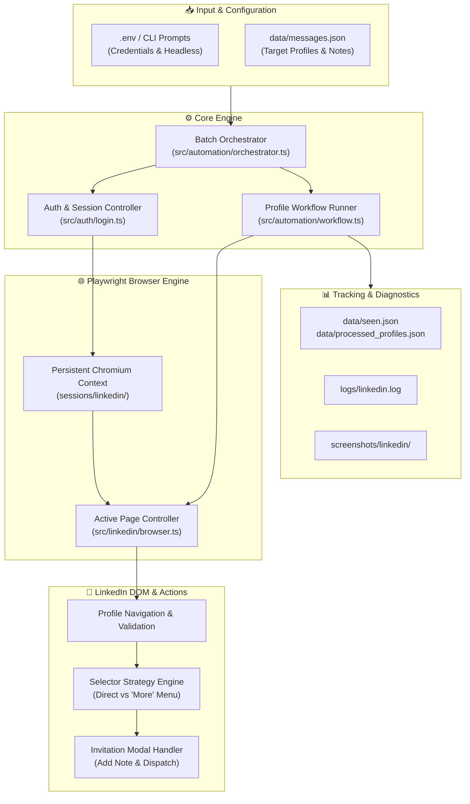
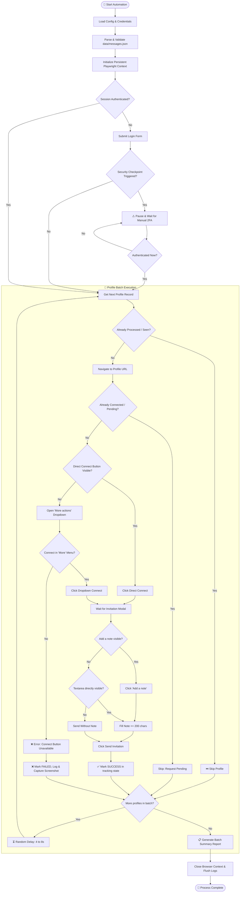
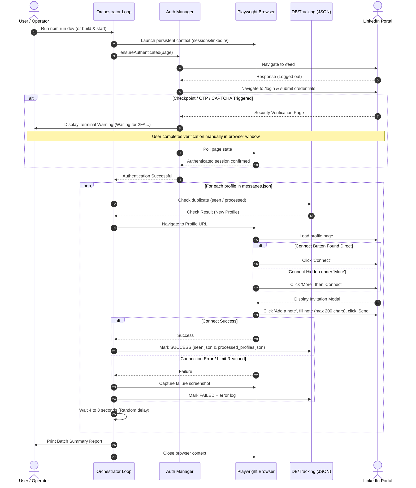

# 🚀 LinkedIn Connection & Outreach Automation

<div align="center">

[](https://www.typescriptlang.org/)
[](https://playwright.dev/)
[](https://nodejs.org/)
[](https://opensource.org/licenses/MIT)
[](https://github.com/kunalsrivastava-dev/Linkedin-Outreach-Automation/pulls)

<p align="center">
  <b>An enterprise-grade, resilient LinkedIn outreach and connection automation engine built with TypeScript and Playwright.</b>
  <br />
  Features persistent browser session caching, multi-stage fallback selector routing, automated 2FA/checkpoint pause-and-resume, and stateful execution tracking.
</p>

</div>

---

## 📑 Table of Contents

- [Overview](#-overview)
- [Key Features](#-key-features)
- [System Architecture](#-system-architecture)
- [Operational Workflow](#-operational-workflow)
- [Sequence Flow Diagram](#-sequence-flow-diagram)
- [Directory Structure](#-directory-structure)
- [Getting Started](#-getting-started)
  - [Prerequisites](#prerequisites)
  - [Installation](#installation)
  - [Environment Configuration](#environment-configuration)
  - [Input Data Setup](#input-data-setup)
- [Running the Automation](#-running-the-automation)
- [State Management & Tracking](#-state-management--tracking)
- [Defensive Design & Anti-Detection](#-defensive-design--anti-detection)
- [Troubleshooting & FAQs](#-troubleshooting--faqs)
- [Contributing](#-contributing)
- [License](#-license)

---

## 🌟 Overview

Connecting with leads, candidates, or industry peers at scale on LinkedIn can be tedious and prone to brittle bot detections. **LinkedIn Outreach Automation** provides an intelligent, human-like automation pipeline designed to:

1. **Eliminate redundant logins** via persistent Playwright browser contexts.
2. **Handle dynamic UI changes** using accessible roles, labels, and fallback menus.
3. **Protect your account** with randomized human delays and automated security challenge interceptors.
4. **Prevent duplicate messages** using persistent history indexing (`seen.json` and `processed_profiles.json`).

---

## ✨ Key Features

| Feature | Description |
| :--- | :--- |
| 🛡️ **Persistent Session Cache** | Stores cookies and local storage in `sessions/linkedin/`, bypassing recurring authentication checks and verification triggers. |
| 🔄 **Multi-Path Selector Engine** | Automatically finds "Connect" on the primary profile header, or cascades into the "More actions" dropdown if hidden. |
| 🛑 **2FA & Checkpoint Intercept** | Detects CAPTCHAs, OTPs, or email pins, suspends script execution, alerts you in the terminal, and automatically resumes once verified. |
| 📝 **Personalized Note Insertion** | Seamlessly opens the invitation modal, inserts custom notes, and auto-truncates to LinkedIn's 200-character note limit. |
| 📊 **Dual State Tracking** | Maintains `data/processed_profiles.json` (detailed logs with timestamps/errors) and `data/seen.json` (fast lookup list). |
| 📸 **Self-Healing Error Diagnostics** | Automatically records error logs to `logs/linkedin.log` and takes full-page viewport screenshots on failures in `screenshots/linkedin/`. |
| ⏳ **Smart Human Throttling** | Random pauses (4–8s) between actions mimic natural human browsing and prevent trigger-based rate limiting. |

---

## 🏗️ System Architecture



---

## 🔄 Operational Workflow



---

## 🕒 Sequence Flow Diagram



---

## 📁 Directory Structure

```text
Linkedin-Outreach-Automation/
├── data/
│   ├── messages.json              # Input queue: Target usernames, URLs & notes
│   ├── processed_profiles.json    # Detailed execution history (timestamp, status, errors)
│   └── seen.json                  # Compact list of all reached-out profile IDs
│
├── sessions/
│   └── linkedin/                  # Persistent browser session & cookie store
│
├── screenshots/
│   └── linkedin/                  # Timestamped failure screenshots for debugging
│
├── logs/
│   └── linkedin.log               # Unified file execution logs
│
├── src/
│   ├── index.ts                   # Application entry point
│   ├── diagnostic_blue.ts         # Utility for inspecting dynamic button selectors
│   │
│   ├── auth/
│   │   ├── auth.types.ts          # Authentication type definitions
│   │   ├── login.ts               # Credentials dispatch & 2FA challenge listener
│   │   └── session.ts             # Session validation routines
│   │
│   ├── automation/
│   │   ├── orchestrator.ts        # Batch iteration loop, delays & summary reporting
│   │   ├── workflow.ts            # Single profile connection pipeline & error handling
│   │   └── retry.ts               # Resilient execution and retry helpers
│   │
│   ├── config/
│   │   ├── constants.ts           # System paths, timeouts, and constant values
│   │   └── env.ts                 # Environment variable parsing and interactive fallback prompts
│   │
│   ├── input/
│   │   ├── json.ts                # JSON schema validator for messages.json
│   │   └── prompts.ts             # Secure terminal interactive prompts
│   │
│   ├── linkedin/
│   │   ├── browser.ts             # Playwright browser instance factory
│   │   ├── connection.ts          # Connect button clicking, modal interaction & note typing
│   │   ├── profile.ts             # Profile navigation, wait conditions & DOM validation
│   │   └── selectors.ts           # Centralized, accessible UI selector definitions
│   │
│   ├── logging/
│   │   ├── logger.ts              # Console and file logger with formatted output
│   │   └── screenshots.ts         # Viewport snapshot capture utility
│   │
│   └── tracking/
│       └── processedProfiles.ts   # Persistent state store for seen and processed users
│
├── .env.example                   # Sample environment configuration template
├── .gitignore                     # Git ignore rules for node_modules, logs & sessions
├── package.json                   # Project metadata, dependencies & scripts
├── tsconfig.json                  # TypeScript compiler settings
└── README.md                      # Project documentation
```

---

## 🚀 Getting Started

### Prerequisites

- **Node.js**: `v18.0.0` or higher
- **npm** or **pnpm** / **yarn**
- Modern Chromium-compatible environment

### Installation

1. **Clone the Repository**
   ```bash
   git clone https://github.com/kunalsrivastava-dev/Linkedin-Outreach-Automation.git
   cd Linkedin-Outreach-Automation
   ```

2. **Install Dependencies**
   ```bash
   npm install
   ```

3. **Install Playwright Browser Binaries**
   ```bash
   npx playwright install chromium
   ```

---

### Environment Configuration

Create your `.env` configuration file from the template:

```bash
cp .env.example .env
```

Edit `.env` to configure your credentials:

```env
# LinkedIn Credentials
LINKEDIN_USERNAME=your.email@example.com
LINKEDIN_PASSWORD=your_secure_password

# Run browser in headful mode (recommended for verification) or headless mode (true/false)
HEADLESS=false
```

> [!NOTE]
> **Interactive Prompt Fallback**: If you leave `LINKEDIN_USERNAME` or `LINKEDIN_PASSWORD` blank in `.env`, the tool will securely prompt you via the terminal at runtime.

---

### Input Data Setup

Populate the `data/messages.json` file with target profiles and customized invitation messages:

```json
[
  {
    "username": "kunal-srivastava",
    "url": "https://www.linkedin.com/in/kunal-srivastava-9a8758258/",
    "message": "Hi Kunal, I came across your work in automation and would love to connect!"
  },
  {
    "username": "alex-tech",
    "url": "https://www.linkedin.com/in/alex-tech-example/",
    "message": "Hey Alex, noticed your interest in TypeScript and Playwright. Let's connect!"
  }
]
```

> [!TIP]
> **Character Limit**: LinkedIn enforces a limit of **200 characters** for connection request notes. Any message exceeding this limit will be automatically truncated cleanly.

---

## ⚡ Running the Automation

### Development Mode (Recommended)
Runs directly with `tsx` for real-time execution:
```bash
npm run dev
```

### Production Build
Compile TypeScript to JavaScript and execute:
```bash
npm run build
npm start
```

---

## 📊 State Management & Tracking

The automation maintains two distinct JSON stores to guarantee idempotency and prevent duplicate outreach:

### 1. `data/processed_profiles.json`
Tracks the exact status, timestamp, and error details of each attempted profile:
```json
{
  "kunal-srivastava": {
    "status": "SUCCESS",
    "timestamp": "2026-08-25T10:00:00.000Z"
  },
  "alex-tech": {
    "status": "FAILED",
    "timestamp": "2026-08-25T10:00:15.000Z",
    "error": "Connect button could not open connection dialog"
  }
}
```

### 2. `data/seen.json`
A lightweight array of processed usernames used for $O(1)$ fast lookups:
```json
[
  "kunal-srivastava"
]
```

- **Successful profiles** are automatically recorded in both files and skipped on subsequent runs.
- **Failed profiles** are recorded with reason in `processed_profiles.json`, allowing them to be retried on future runs after resolving the issue.

---

## 🛡️ Defensive Design & Anti-Detection

> [!IMPORTANT]
> **Safety Guidelines for LinkedIn Automation**:
> - **Session Persistence**: Reusing sessions minimizes login frequency and helps avoid triggering bot alarms.
> - **Humanized Delays**: The orchestrator automatically pauses for **4 to 8 seconds** (randomized) between profile requests.
> - **Weekly Invitation Limits**: LinkedIn imposes weekly invitation limits (typically 100–200/week). Keep your daily batches moderate (15–30 requests/day).
> - **Headful Mode Recommended**: Running with `HEADLESS=false` enables natural rendering and allows you to easily resolve any interactive security challenges.

---

## 🔍 Troubleshooting & FAQs

<details>
<summary><b>1. What happens if LinkedIn prompts for a CAPTCHA or 2FA OTP?</b></summary>
<br/>
The script detects security checkpoints (such as <code>/checkpoint/</code> or pin inputs). It pauses the automation and displays a notice in your console. Complete the verification directly in the open browser window; once authenticated, the script detects the change and resumes automatically.
</details>

<details>
<summary><b>2. How can I reset the saved browser session?</b></summary>
<br/>
Delete the <code>sessions/linkedin/</code> folder. On the next execution, the script will create a fresh session and prompt for login.
</details>

<details>
<summary><b>3. Why was a profile marked as FAILED?</b></summary>
<br/>
Check <code>logs/linkedin.log</code> and the corresponding snapshot in <code>screenshots/linkedin/</code>. Common causes include:
<ul>
  <li>Profile has disabled connection requests or requires an email address.</li>
  <li>You have reached your weekly invitation limit.</li>
  <li>The profile page structure was temporarily unavailable or blocked.</li>
</ul>
</details>

<details>
<summary><b>4. How can I inspect selectors if LinkedIn changes its DOM?</b></summary>
<br/>
Use the built-in diagnostic script:
<pre><code>npx tsx src/diagnostic_blue.ts</code></pre>
This script dumps all active buttons and ARIA attributes for rapid debugging.
</details>

---

## 🤝 Contributing

Contributions, issues, and feature requests are welcome!

1. Fork the repository
2. Create your feature branch (`git checkout -b feature/AmazingFeature`)
3. Commit your changes (`git commit -m 'Add some AmazingFeature'`)
4. Push to the branch (`git push origin feature/AmazingFeature`)
5. Open a Pull Request

---

## 📄 License

Distributed under the **MIT License**. See `LICENSE` for more information.

<div align="center">
  <sub>Built with ❤️ by <a href="https://github.com/kunalsrivastava-dev">Kunal Srivastava</a></sub>
</div>
